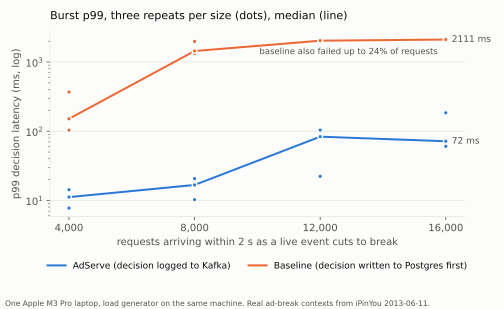
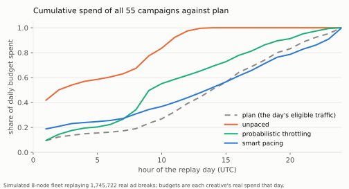

# AdServe: Video Ad Server

AdServe is a video ad server in Java 21 and Spring Boot. Given one ad break (viewer, title,
break length, device, region), it evaluates every campaign's targeting, enforces policy and
frequency caps, paces each campaign's daily budget, fills the break with a pod of creatives
(which ads, in which order, never two car ads back to back), signs a token for every
impression, and logs the decision to Kafka without a database write on the request path.
**Traffic is replayed from real ad logs, and the viewers are simulated.** The requests are the
1,745,722 impression rows of one day of the public iPinYou RTB dataset (season 2, 2013-06-11), and the
campaigns are that day's 55 real creatives from 5 advertisers, each with a daily budget equal to
what it actually paid that day and a click rate taken from the click logs. No one watched
anything. Where the log has no field for something a video ad server needs (break length,
creative duration, a TV device class, title genre), a deterministic rule fills it in, and
`DESIGN.md` lists every such rule. Every latency figure comes from one laptop, with the load
generator running on that same machine. None of them is a production-scale claim.

## What it does

```
ad break request (gRPC or REST)
   -> admission: LIVE before VOD when saturated (503 / RESOURCE_EXHAUSTED + retry hint)
   -> resolve      viewer segments, geo, device, genre
   -> targeting    every campaign's rules compiled to bitsets, evaluated without allocating
   -> policy       flight, budget, brand safety
   -> caps         one Redis round trip for the viewer's frequency counters
   -> pacing       each campaign's pass-through rate (LinkedIn throttling, Smart Pacing, PID)
   -> pod          fill the break: DP over 15 s slots, one ad per advertiser, no car ad after a car ad
   -> tokens       HMAC-signed impression tokens carrying the serving region
   -> log          whole decision to Kafka, fire and forget. No database on this path.
```

Around it: a beacon consumer that counts confirmed impressions with idempotent Lua scripts, a
Flink job that joins beacons to decisions and writes a deduplicated billing table, a GraphQL
campaign API on Netflix's open-source DGS framework, the campaign snapshot optionally delivered
with Hollow, a React delivery console, and Prometheus and Grafana.

## Results

Measured on one Apple M3 Pro laptop with the load generator on the same machine; every figure
is a range over repeats and comes with its file in `NUMBERS.md`.

| Question | Result | Baseline |
|---|---|---|
| p99 when 8,000 ad breaks arrive within 2 s (offered peak about 7,700/s) | median 21.1 ms, worst 122.9 ms over 12 runs, 0 errors; best configuration 7.3 to 10.2 ms with every cap check answered | writing each decision to Postgres first: above 1 s in all 6 runs |
| Serving with Postgres stopped | 24,000 of 24,000 decided | sync-write baseline: 0 of 24,000 |
| Budget pacing over one real day, 55 campaigns | Smart Pacing: 54 of 55 within 5% of budget, none overspent, none out of budget early | unpaced: 50 of 55 out of budget by about 07:51; without the per-node allowance, one budget overspent 7.99x |
| Frequency caps with 5 to 20% duplicated beacons | 0 violations and 0.00% counter drift across 30,870 duplicated deliveries | naive INCR: counters 104 to 124% high; counting from beacons only: 153 to 317 violations |
| Billing with 5 to 20% duplicated beacons (Flink job) | 15,111 impressions billed, each exactly once, 0 missing, across 11,370 duplicates; every campaign's total equals the beacon consumer's independent count | |
| Pod value against the exact optimum, 5,000 real breaks | DP: 0.00% below the optimum on every break, p99 23 us | greedy: 8.35% below on average |
| LIVE during 2x overload | LIVE p99 7.8 and 17.0 ms, 74% of VOD refused with a retry hint | no shedding: LIVE p99 40.9 and 60.2 ms |
| CPU per decision (JMH) | 16.5 us: 55 targeting predicates in 182 ns, DP pod 7.3 us, token 280 ns | |
| Campaign change reaching a serving node over Hollow, 5,000 campaigns | about 1.1 KB delta against a 1.18 MB snapshot, about 1 s (the watcher polls each second) | |





Two things to know before quoting any burst figure. Under a burst, a decision whose Redis read
misses its 20 ms deadline is served without the cap check (in the configured cap mode); the count
is recorded for every run and was 0 in the best configuration and up to 57% of decisions in the
worst. And tail latency on this shared laptop varied up to 10 times between repeats.

Every figure, the file it came from, the machine and the load are in `NUMBERS.md`. The design
and every assumption the logs could not supply are in `DESIGN.md`; bugs found along the way, and
the tool that found each, are in `BUG_LOG.md`.

## Quickstart

Java 21, Docker, and nothing else for the demo (it uses the committed 20,000-break sample):

```
scripts/demo.sh
```

It starts Kafka, Redis, Postgres, Prometheus and Grafana, AdServe, the beacon consumer and the
Flink billing job, plays 2,000 real ad breaks as simulated viewers who fire beacons with
duplicates, and prints what the billing table counted. Then open the console at
`http://localhost:28080/console/`, GraphiQL at `http://localhost:28080/graphiql`, and Grafana at
`http://localhost:23000`.

Ask for one ad break yourself:

```
curl -s -X POST localhost:28080/v1/decide -H 'content-type: application/json' -d '{
  "requestId": "r1", "viewerId": "v1", "titleId": "t1", "genre": "drama", "breakLengthS": 90,
  "device": "tv", "region": "US_EAST", "priority": "LIVE", "tsMs": 1370950000000, "geo": "r1"}'
```

Create a campaign that the next decision can serve:

```graphql
mutation {
  createCampaign(input: {
    id: "launch-1", advertiserId: "acme", name: "Launch week", category: "software",
    cpcBidMicros: 900000, dailyBudgetMicros: 50000000, startsAt: "2013-06-11", endsAt: "2013-06-12",
    pacer: SMART, capPerDay: 2, targeting: { devices: [TV] },
    creatives: [{ id: "launch-1-30", durationS: 30, clickRate: 0.002 }]
  }) { id delivery { spendMicros pacingRate } }
}
```

### The full dataset and the experiments

The experiments replay two full days of iPinYou logs (about 230 MB compressed, not in the
repo). With a Kaggle token in `~/.kaggle`:

```
scripts/fetch-ipinyou.sh                 # imp and clk logs for 2013-06-10 and 2013-06-11
./gradlew :sim:installDist
sim/build/install/sim/bin/sim load-ipinyou   # -> data/work/requests-*.bin, campaigns.json
sim/build/install/sim/bin/sim forecast       # -> data/work/forecast.json
scripts/run-all.sh exp1-burst exp3-caps exp6-dependency exp7-billing exp2-pacing
```

Each script records into `results/*.jsonl`. The laptop they ran on was shared with another
project's benchmarks, so every load script takes a lock directory first (`scripts/lib.sh`).

## Layout

| Path | What |
|---|---|
| `contract/ads.proto` | The API: AdRequest, AdResponse, Token, Beacon, DecisionRecord, the gRPC service |
| `core/` | The decision path and every algorithm, no I/O: targeting, policy, caps, pacers, pod solvers, tokens, Hollow snapshot |
| `server/` | Spring Boot: gRPC, REST, DGS GraphQL, Kafka log, Redis counters, Postgres store, shedding, console |
| `beacons/` | Beacon consumer and the idempotent Redis scripts |
| `billing/` | Flink billing job |
| `sim/` | iPinYou loader, pacing simulator, cap and billing experiments, open-loop load generator |
| `ui/` | Delivery console (React, TypeScript) |
| `deploy/` | Postgres schema, Prometheus, Grafana |

## Tests

`./gradlew build` runs unit tests and jqwik property tests (every pod solver on thousands of
random catalogues; branch and bound equals brute force). `./gradlew test -Pintegration` adds
Testcontainers tests against real Postgres, Kafka and Redis, including a campaign created
through GraphQL being served by the next decision and a viewer capped only by confirmed beacons
not being served. CI also runs a 30-second load smoke.
